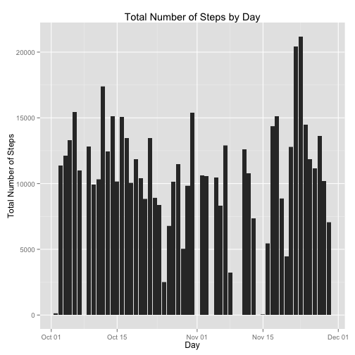
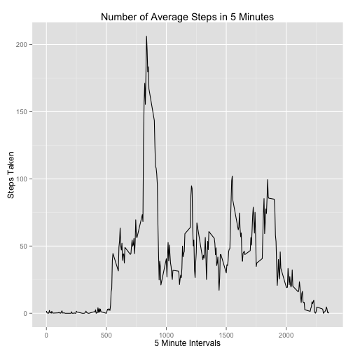

## Loading and preprocessing the data

We are assuming that the activity.zip file is in the current directory, so let's extract the data into a **activity.csv** file and load it.


```r
activity = read.csv(file='activity.csv',sep=',',header=TRUE,colClasses=c('integer','Date','integer'))
```

## What is mean total number of steps taken per day?

Next let's look at the data.  We're asked to calculate the mean and median, and to make a histogram of the total number of steps taken per day.


```r
activity_step_mean = mean(activity$steps, na.rm = TRUE)
activity_step_median = median(activity$steps, na.rm = TRUE)
```

The mean of the distribution is 37.3826, and the median is a statistically unlikely yet expected 0.


```r
ggplot(activity, aes(date, steps),type='l') + geom_bar(stat = "identity")+ labs(title = "Total Number of Steps by Day", x = "Day", y = "Total Number of Steps")
```

```
## Warning: Removed 2304 rows containing missing values (position_stack).
```

 

Note that this output warns us that there is missing data.

## What is the average daily activity pattern?

Now aggregate the number of steps by the interval, and plot the results in a series.


```r
activity_by_day <- with(activity, aggregate(steps ~ interval, FUN=mean, na.rm=T))
ggplot(activity_by_day, aes(interval, steps)) + geom_line() + xlab("5 Minute Intervals") + ylab("Steps Taken") + ggtitle("Number of Average Steps in 5 Minutes")
```

 

From looking at the chart, it appears that our maximum value is around 205, so lets find out.


```r
activity_by_day_mean = activity_by_day[,1] * activity_by_day[,2] / activity_by_day[,1]
activity_by_day_most = activity_by_day[which.max(activity_by_day_mean),]
```

It looks like our most active 5-minute interval was ``835``, with an mean value of ``206.1698`` steps in a typical 5-minute interval, or ``41.234`` steps per minute.

## Imputing missing values


## Are there differences in activity patterns between weekdays and weekends?
