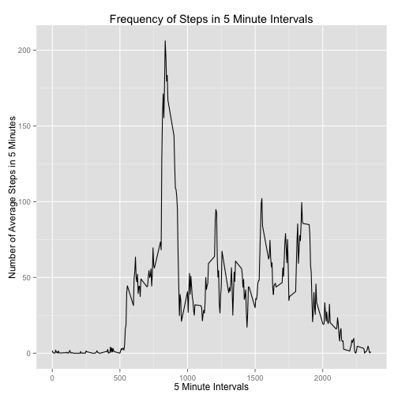
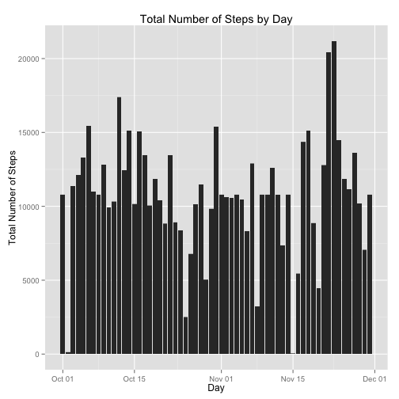
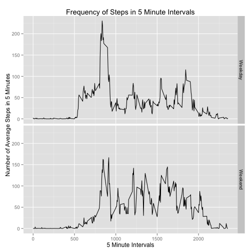

## Loading and preprocessing the data

We are assuming that the activity.zip file is in the current directory, so let's extract the data into a **activity.csv** file and load it.


```r
activity_base = read.csv(file='activity.csv',sep=',',header=TRUE,colClasses=c('integer','Date','integer'))
```

## What is mean total number of steps taken per day?

Next let's look at the data.  We're asked to calculate the mean and median, and to make a histogram of the total number of steps taken per day.


```r
activity_base_by_day = with(activity_base, aggregate(steps ~ interval, FUN=mean, na.rm=T))
activity_base_step_mean = mean(activity_base_by_day$steps)
activity_base_step_median = median(activity_base_by_day$steps)
```

The mean of the distribution is 37.3826, and the median is 34.1132.

|    | Mean   | Median  |
|---:|:------:|:-------:|
|  Base Data | 37.3826  | 34.1132  |

Note let's look at the histogram.


```r
ggplot(activity_base, aes(date, steps),type='l') + geom_bar(stat = "identity")+ labs(title = "Total Number of Steps by Day", x = "Day", y = "Total Number of Steps")
```

```
## Warning: Removed 2304 rows containing missing values (position_stack).
```

 

Note that this output warns us that there is missing data.

## What is the average daily activity pattern?

Now aggregate the number of steps by the interval, and plot the results in a series.


```r
ggplot(activity_base_by_day, aes(interval, steps)) + geom_line() + xlab("5 Minute Intervals") + ylab("Number of Average Steps in 5 Minutes") + ggtitle("Frequency of Steps in 5 Minute Intervals")
```

 

From looking at the chart, it appears that our maximum value is around 205, so lets find out.


```r
activity_base_by_day_mean = activity_base_by_day[,1] * activity_base_by_day[,2] / activity_base_by_day[,1]
activity_base_by_day_most = activity_base_by_day[which.max(activity_base_by_day_mean),]
```

It looks like our most active 5-minute interval was ``835``, with an mean value of ``206.1698`` steps in a typical 5-minute interval, or ``41.234`` steps per minute.

## Imputing missing values

Our next task is to find, count, and replace missing values.  We're interested in missing data values, those of the steps.


```r
total_missing_values = sum(is.na(activity_base$steps))
```

We have 2304 missing values, so lets fix them by filling them with their equivalent average.


```r
activity_full = transform(activity_base, 
  steps = ifelse(is.na(steps), 
    ave(steps, interval, FUN = function(x) mean(x, na.rm = TRUE)), 
    steps)
  )
```

Let's see the effect.


```r
activity_full_by_day <- with(activity_full, aggregate(steps ~ interval, FUN=mean, na.rm=T))
activity_full_step_mean = mean(activity_full_by_day$steps)
activity_full_step_median = median(activity_full_by_day$steps)
ggplot(activity_full, aes(date, steps),type='l') + geom_bar(stat = "identity")+ labs(title = "Total Number of Steps by Day", x = "Day", y = "Total Number of Steps")
```

 

Looking at the new means, median, and histogram, we don't see any major differences in the data.  The only difference appears to be that the histogram now presents data for every day.

|    | Mean   | Median  |
|---:|:------:|:-------:|
|  Base Data | 37.3826  | 34.1132  |
|  Full Data | 37.3826  | 34.1132  |

The lack of change in these values between the base and full datasets suggests that our imputing of additional data may not significantly altering our analysis.

## Are there differences in activity patterns between weekdays and weekends?

Now lets compare weekdays to weekends.  To do this, we need to determine if an observation was made on a weekend or weekday, then plot the data using this new variable as a facet.


```r
activity_full$day = factor( ifelse(weekdays(activity_full$date) %in% c("Saturday","Sunday"),'Weekend','Weekday') )
activity_full_by_day <- with(activity_full, aggregate(steps ~ interval + day, FUN=mean, na.rm=T))
ggplot(activity_full_by_day, aes(interval, steps)) + geom_line() + facet_grid(day ~ .) + xlab("5 Minute Intervals") + ylab("Number of Average Steps in 5 Minutes") + ggtitle("Frequency of Steps in 5 Minute Intervals")
```

 

Although the overall distribution of intervals share a similar shape, the specific data points are notably different.  Just to make sure, let's take a look.


```r
activity_full_is_weekend = activity_full_by_day[activity_full_by_day$day == 'Weekend',]
activity_full_max_weekend = activity_full_is_weekend[which.max(activity_full_is_weekend$steps),]
activity_full_is_weekday = activity_full_by_day[activity_full_by_day$day == 'Weekday',]
activity_full_max_weekday = activity_full_is_weekday[which.max(activity_full_is_weekday$steps),]
```

For weekdays, our maximum interval is ``835`` with an average of ``230.3782`` steps, whereas for weekends our maximum internval is ``915`` with ``166.6392`` on average.

